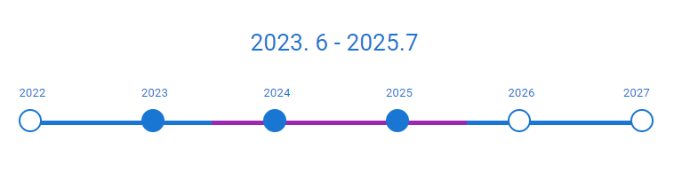
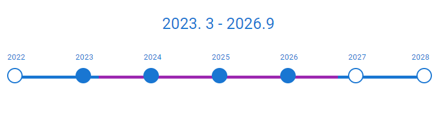
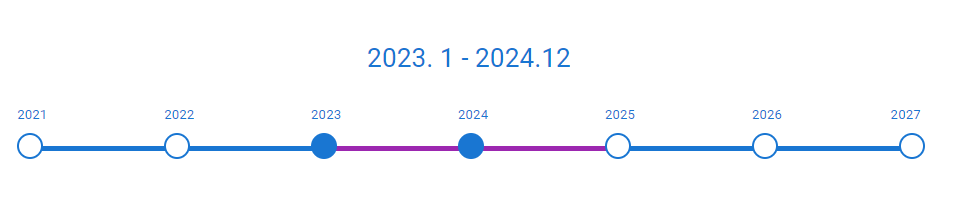

# Module E - Next-Gen Innovations
* **Automated Testing**
Competitors will demonstrate their proficiency in writing comprehensive automated tests for selected JavaScript components, ensuring the reliability and stability of the guest experience. 
* **Web Component Creation**
Developers will design and implement versatile web components to enhance the web application's interactivity and user experience. These components should showcase reusability and seamless integration into the DineEase platform.
* **Progressive Web App (PWA) Development**
Participants will create a simple yet powerful PWA that serves as the foundation for a future mobile web app. 
The PWA should support offline functionality, push notifications, and seamless installation for enhanced accessibility.

## Task List:

### Automated Tests:
- ...
### Web Components:
Create a standalone web component named `DateTimeline` to visually represent a range of years.

#### Features:

##### 1. Display
- The timeline displays a horizontal representation of years.
- Each year on the timeline is symbolized by a circle, with the year value displayed above it.

##### 2. Props
- **starting**: An object containing a `year` and `month` property to denote the start date.
- **ending**: An object containing a `year` and `month` property to denote the end date.

##### 3. Range Behavior
- The year immediately following the `ending` year should **always be displayed** on the timeline regardless of the range (except when the interval is more then 6 years).
- If the year interval is **less than 5 years**, the timeline should symmetrically extend to show at least a 5 or 6 year interval.
- If the year interval is **more than 6 years**, display only the first 6 years starting from the `starting` year. Following this range, there should be a short, dotted line, indicating a summarized view.

##### 4. Visual Indicators
- A distinct line segment should appear on the timeline between the starting and ending dates to indicate the "highlighted" range. This segment's color differs from the rest of the timeline.
- Circles falling inside this highlighted range are filled, while those outside the range are only outlined.
- If the timeline is showing a summarized view (more than 6 years difference), the timeline's right end should have a dotted line extension to indicate truncation.

##### 5. No Dependencies
- This component should be built without relying on any libraries or frameworks.
##### 6. Examples

### PWA Development:
- ...