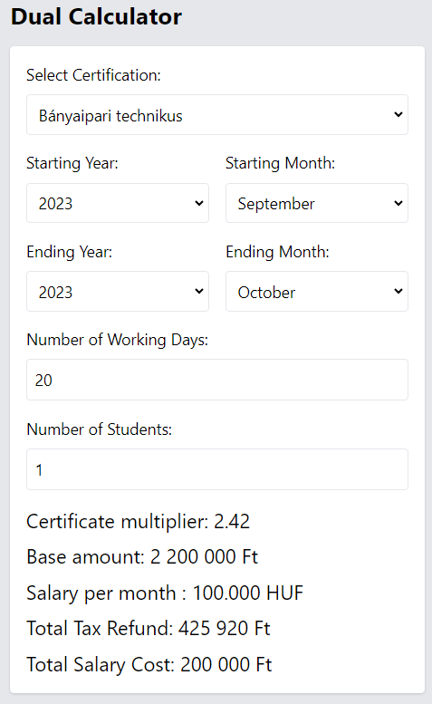
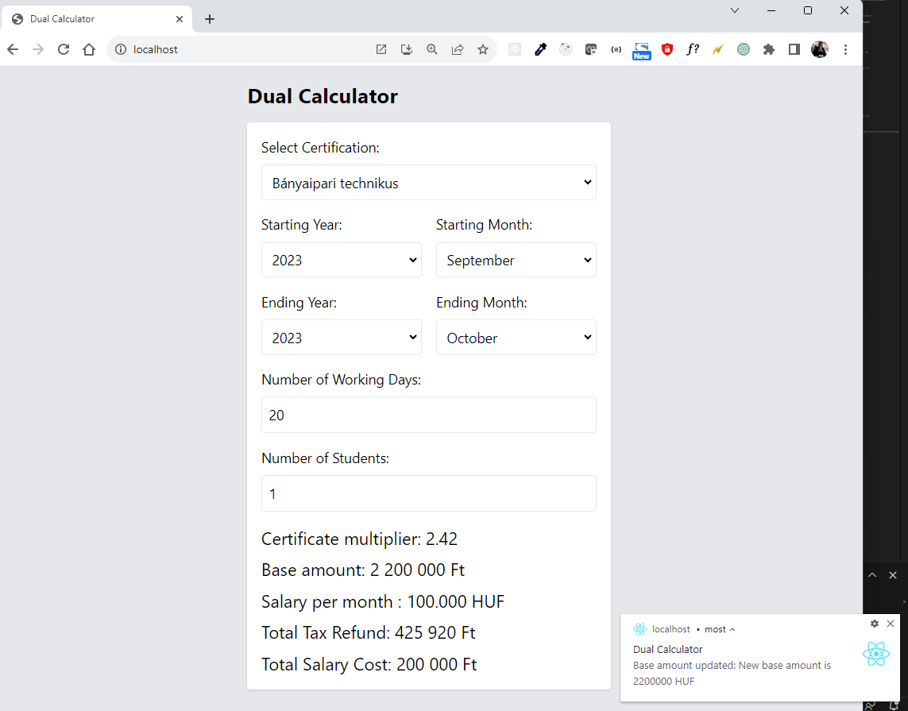

# Module E - Next-Gen Innovations
* **Automated Testing**
Competitors will demonstrate their proficiency in writing comprehensive automated tests for selected JavaScript components, ensuring the reliability and stability of the guest experience. 
* **Web Component Creation**
Developers will design and implement versatile web components to enhance the web application's interactivity and user experience. These components should showcase reusability and seamless integration into the DineEase platform.
* **Progressive Web App (PWA) Development**
Participants will create a simple yet powerful PWA that serves as the foundation for a future mobile web app. 
The PWA should support offline functionality, push notifications, and seamless installation for enhanced accessibility.

## Task List:

### Automated Tests:

The `DualCalculator` class is a tool that enables dual employer partners to calculate tax refunds and wage costs under various dual training scenarios and conditions. This class interacts with two services. The `SectorService` classifies certifications and maintains the sector-specific multiplier values (e.g., 2.2, 2.42, or 2.85) used in tax refund calculations. On the other hand, the `CertificationService` manages certification entities.

When instantiating the `DualCalculator`, you can provide the starting and ending dates (specified by year and month) of the dual training period, the certification ID, the number of students undergoing dual training, the base amount, the monthly salary paid to these students, and the number of dual training days within the period. Using this information, along with data from the aforementioned services, the calculator computes both the total tax refund and the total salary paid to students.

Both the `SectorService` and `CertificationService` fetch their required data from a server. To launch this server, run the `node server` command within the `/tests/dual-calculator-server` directory.

In the formula for the total tax refund, the base amount is divided by 250 (the number of working days in a year), then multiplied by the sector multiplier. This gives us the amount of tax refund per day and per student. To calculate the total tax refund, this amount should be further multiplied by the number of days spent in training and the number of students participating in the training.

To calculate the total amount spent on salaries, you first need to determine how many months the dual training lasts, then multiply this by the monthly salary and the number of students.

- In this task, you need to demonstrate your proficiency in testing using the popular testing framework, Jest. The primary goal is to assess contestants' ability to write effective unit tests that ensure the correctness and reliability of their codebase.
- You will be provided with a set of pre-defined JavaScript objects and functions that you need to test using Jest. You can find the code inside the `tests/dual-calculator/src` folder.  
- It is expected to write comprehensive test cases that cover different scenarios, including edge cases and common usage scenarios. They should ensure that their tests are well-structured, readable, and capable of catching potential bugs and errors. Points will be awarded based on the accuracy of the tests, the coverage of code paths, and the overall quality of the testing suite.

### Web Components:
Create a standalone web component named `DateTimeline` to visually represent a range of a dual training period.

#### Features:

##### 1. Display
- The timeline displays a horizontal representation of years.
- Each year on the timeline is symbolized by a circle, with the year value displayed above it.

##### 2. Props
- **starting**: An object containing a `year` and `month` property to denote the start date.
- **ending**: An object containing a `year` and `month` property to denote the end date.

##### 3. Range Behavior
- The year immediately following the `ending` year should **always be displayed** on the timeline regardless of the range (except when the interval is more then 6 years).
- If the year interval is **less than 5 years**, the timeline should symmetrically extend to show at least a 5 or 6 year interval.
- If the year interval is **more than 6 years**, display only the first 6 years starting from the `starting` year. Following this range, there should be a short, dotted line, indicating a summarized view.

##### 4. Visual Indicators
- A distinct line segment should appear on the timeline between the starting and ending dates to indicate the "highlighted" range. This segment's color differs from the rest of the timeline.
- Circles falling inside this highlighted range (including the starting year) are filled, while those outside the range are only outlined.
- If the timeline is showing a summarized view (more than 6 years difference), the timeline's right end should have a dotted line extension to indicate truncation.

##### 5. No Dependencies
- This component should be built without relying on any libraries or frameworks.
##### 6. Examples


### PWA Development:
Your task is divided into two phases. In phase 1, you'll create the dual calculator based on the classes you've tested in the Automated Test task. In phase 2, you'll be provided with the fully working version of the calculator. Your challenge will be to transform it into a PWA. This PWA should be installable, function seamlessly offline, and be able to handle push notifications from the provided backend.

#### Phase 1: Dual Calculator Development

##### Requirements:

###### HTML Structure:
- Integrate `tailwind.css` and `dualCalculator.js` into your HTML.
- Incorporate a dropdown for certificate selection.
- Add dropdowns for:
  - Starting year with a range from 2023 to 2027 and a default of 2023.
  - Starting month with a default of September.
  - Ending year with a range from 2023 to 2028 and a default of 2023.
  - Ending month with a default of October.
- Include number inputs for working days (with a default of 20) and the number of students (defaulting to 1).


###### JavaScript Functionality:
- Fetch certificates and populate the certificate dropdown using data from the `/certificates` endpoint.
- Obtain the base amount for calculations from the `/base-amount` endpoint.
- Instantiate the `DualCalculator` class and invoke appropriate methods to derive tax refunds and salary costs.
- Implement real-time recalculation and update displayed values when any input undergoes modification.

###### Tailwind CSS Styling:
- Adopt a coherent design approach, employing harmonious colors and typography.
- Ensure that the design is mobile-responsive.
- Match the layout and design aesthetics to the provided wireframe.

###### Testing:
- Confirm the accuracy of the calculator's computations.
- Validate real-time updates of displayed values on input alterations.
- Examine the interface's responsiveness across various screen dimensions.

###### Documentation:
- Maintain clarity and organization in your codebase.
- Include comments where necessary, detailing any decisions or assumptions made.
- Ensure all HTML, CSS (barring Tailwind), and JS (aside from `dualCalculator.js`) are consolidated into a singular file.

> **Note:**  
Your work will be evaluated based on functionality, design quality, code clarity, and the overall user experience. Ensure you adhere to best practices throughout your development process.

#### Phase 2: PWA Development with Notifications



1. **PWA Installation & Offline Functionality**
    - Ensure your application can be installed as a Progressive Web App.
    - The application should function offline by caching necessary assets and data.

2. **Push Notification Integration**
    - Subscribe to push notifications by making a POST request to `/subscribe`.
    - Handle incoming notifications and display them to the user.
    - Note: For testing purposes, the server increments the base amount by 50,000 and sends a notification every set interval (default: 20 seconds).

3. **Fetching Data**
    - Fetch the base amount from the `/base-amount` endpoint.
    - Fetch the sectors using the `/sectors` endpoint.
    - Fetch the certificates from the `/certificates` endpoint.

4. **Configuring Notification Interval**
    - The backend provides an option to set the notification interval via the `/interval` endpoint. You can use this during testing to adjust the frequency of push notifications. Default is 20 seconds, but can be modified as needed.

5. **Description of the APIs**
    - **/subscribe**: Accepts a subscription object to register a client for push notifications.
    - **/trigger-push**: Manually triggers a push notification to all subscribed clients. This endpoint is mostly for testing purposes. (not used here)
    - **/base-amount**: Provides the current base amount used in the calculator.
    - **/sectors**: Returns a list of sectors.
    - **/certificates**: Returns a list of available certificates.
    - **/interval**: Accepts a new interval (in milliseconds) and updates the frequency of automatic base amount updates and notifications.

6. **Notification Service Details**
    - Notifications will be sent using the VAPID method, with the provided public and private keys. The public key is: `BMFpN5ygbDHD48ZqHhMiK3HzbyNYNlMK8utm5_it3qcWGBsEi22n674SR5MDB_Fs5LH08R1sHJRxPUSDlbwnagU`
    - Each notification contains the updated base amount, a title, a body, an icon, and data specific to the notification.The server will automatically send a notification about the base amount update every set interval.
    
    ```
    {
        title: `Base Amount Updated`,
        body: `New base amount is 2050000 HUF`,
        icon: "icons/icon-512x512.png",
        data: {
            baseAmount: baseAmount,
        }
    }
    ```

7. **Security & Best Practices**
    - Ensure you handle data responsibly. Protect user's subscription details and ensure that push notifications don't become intrusive.
    - Implement error-handling for potential issues like failed push subscriptions or errors during the notification process.

8. **Testing & Documentation**
    - Thoroughly test the offline functionality and the responsiveness of your PWA.
    - Test push notification behavior to ensure notifications are received and displayed correctly.
    - Document any special considerations or assumptions you've made during the development process.

9. **Submission**
    - Ensure all dependencies are clearly listed.
    - Package and submit your application adhering to the specified guidelines.

> **Note:**  
Your Phase 2 work will be assessed based on the PWA's functionality, the reliability of offline operations, the efficiency of push notifications, and the overall user experience.

